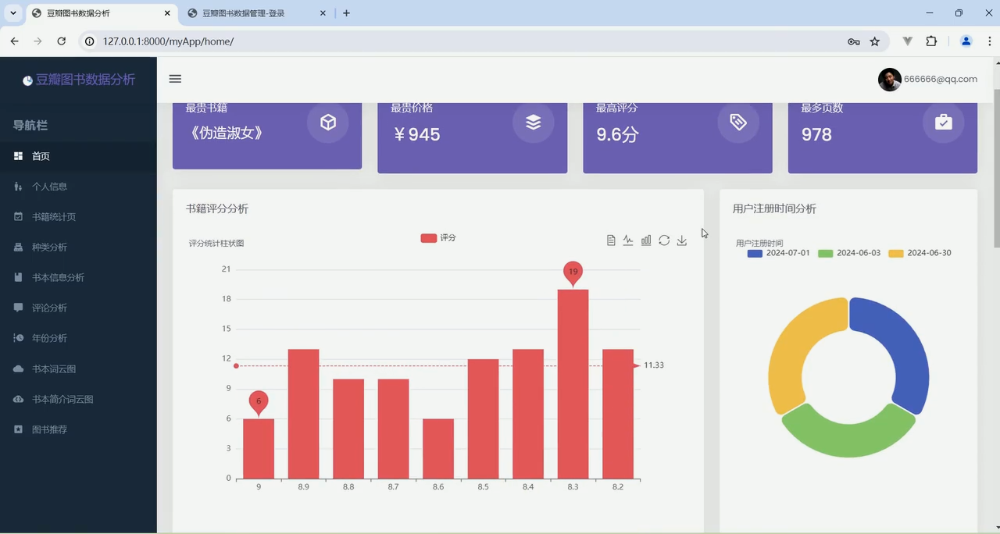
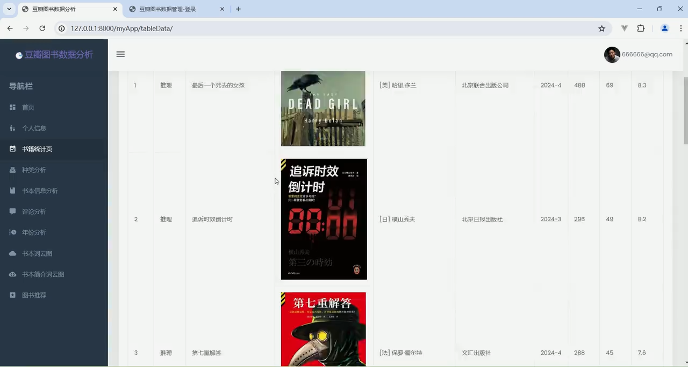
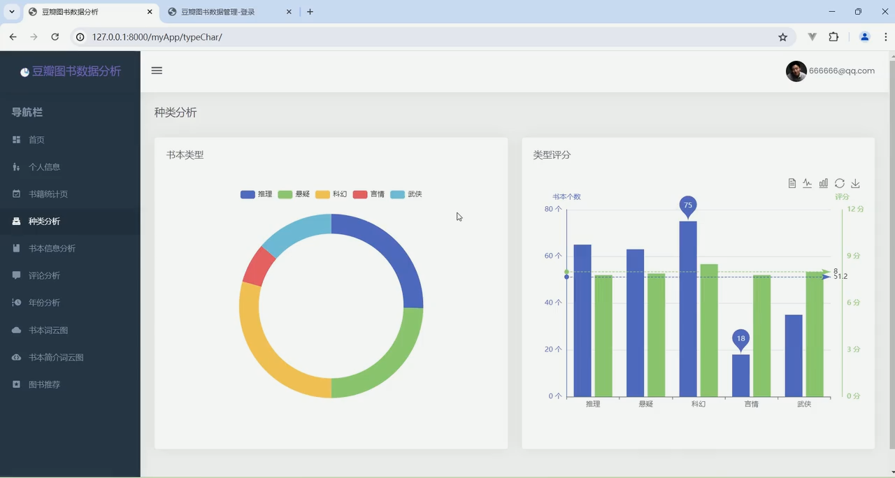
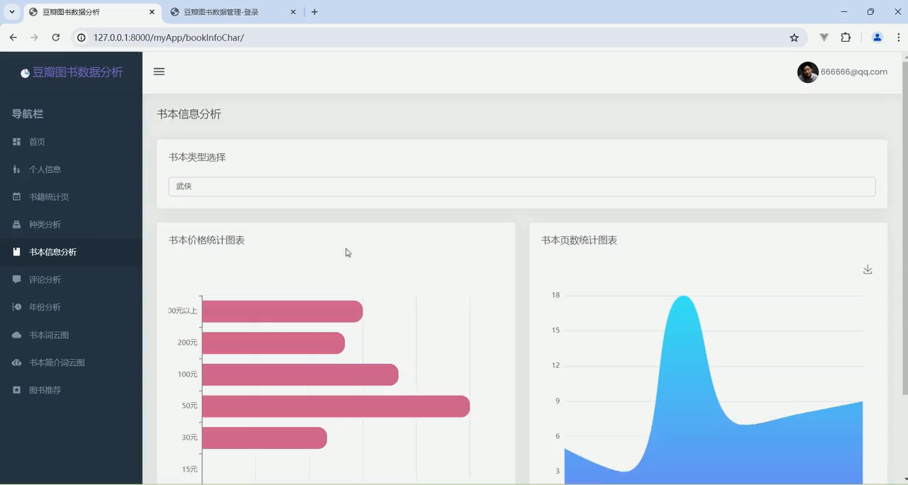
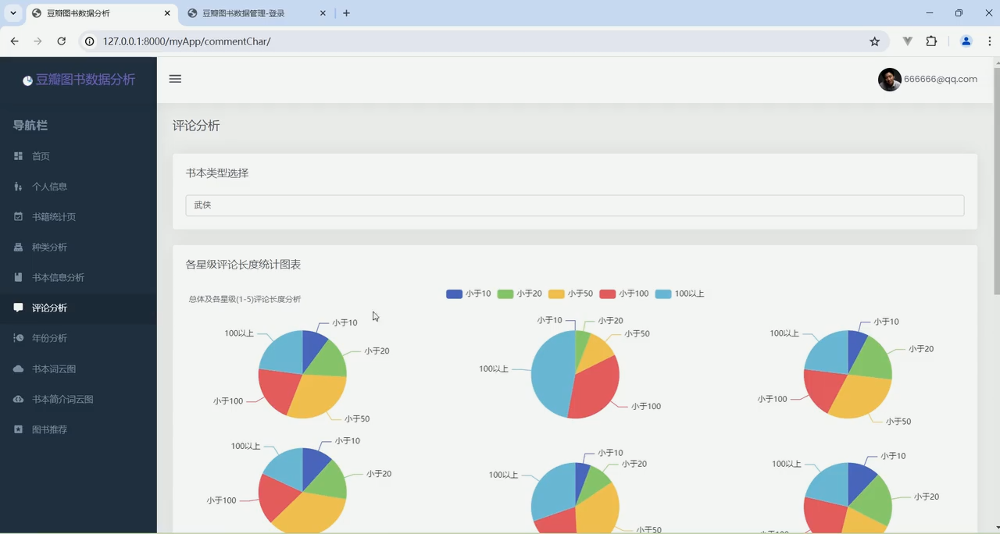
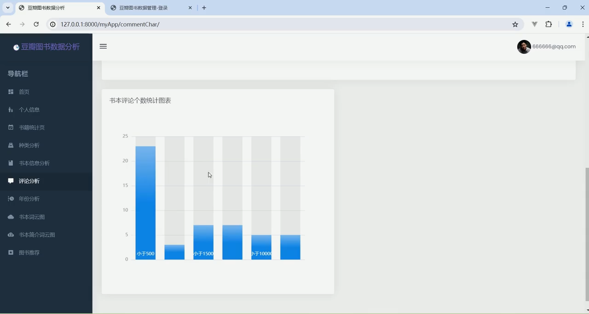
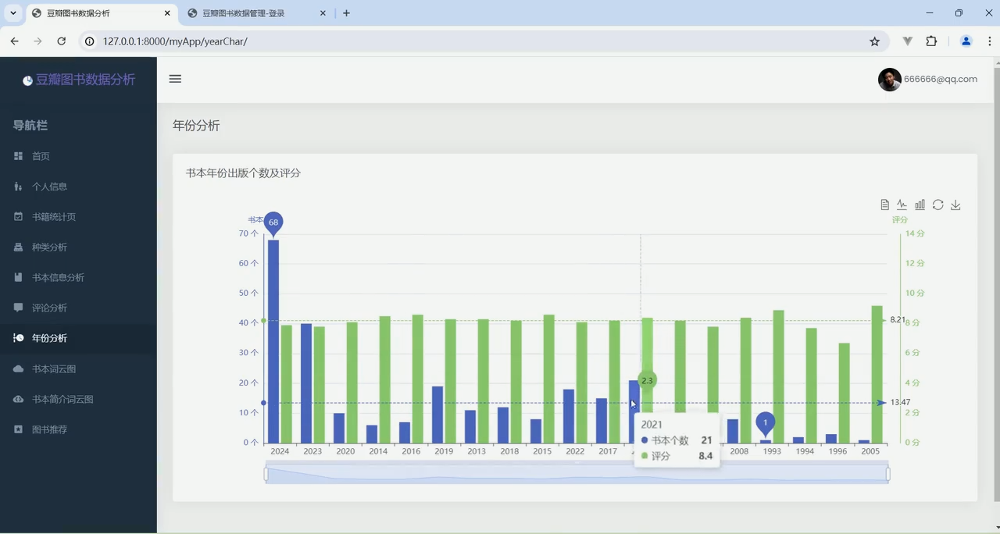
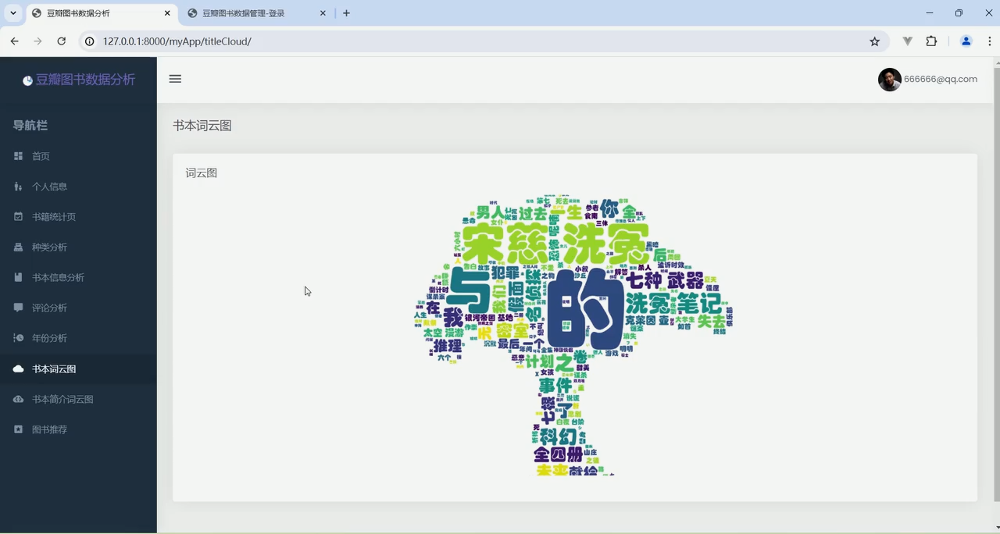
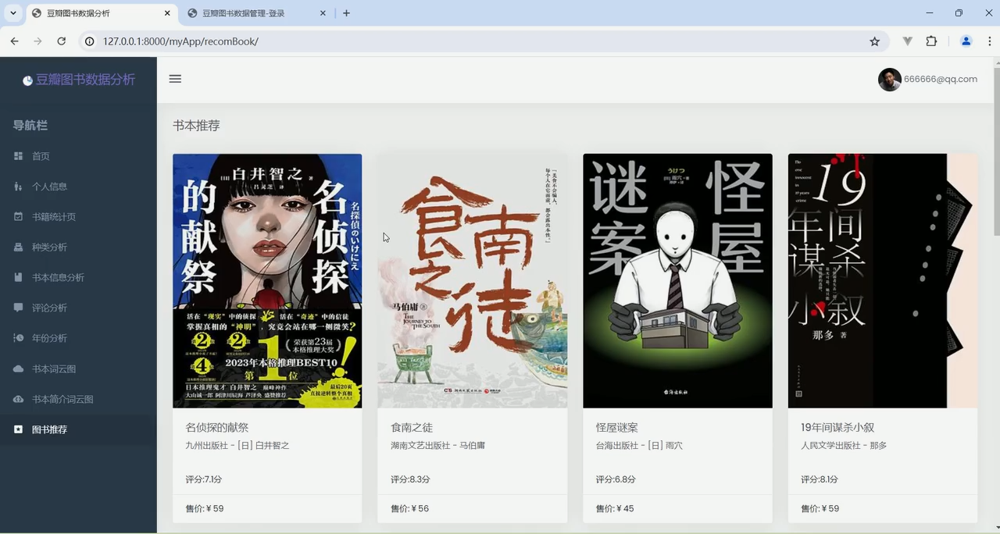
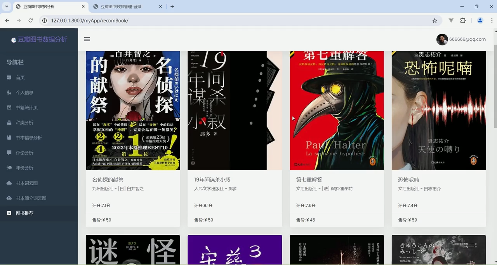

## 计算机毕业设计Django+Vue.js豆瓣图书推荐系统 图书评论情感分析 豆瓣图书可视化大屏 豆瓣图书爬虫 数据分析 图书大数据 大数据毕业设计 机器学习

## 要求
### 源码有偿！一套(论文 PPT 源码+sql脚本+教程)

### 
### 加好友前帮忙start一下，并备注github有偿纯python图书推荐
### 我的QQ号是2827724252或者798059319或者 1679232425或者微信:bysj2023nb 或bysj1688

# 

### 加qq好友说明（被部分 网友整得心力交瘁）：
    1.加好友务必按照格式备注
    2.避免浪费各自的时间！
    3.当“客服”不容易，repo 主是体面人，不爆粗，性格好，文明人。
	
## 技术栈：django、mysql、requests、基于用户协同过滤推荐算法

## 演示视频

https://www.bilibili.com/video/BV1q824YcE2Y/

## 演示截图

